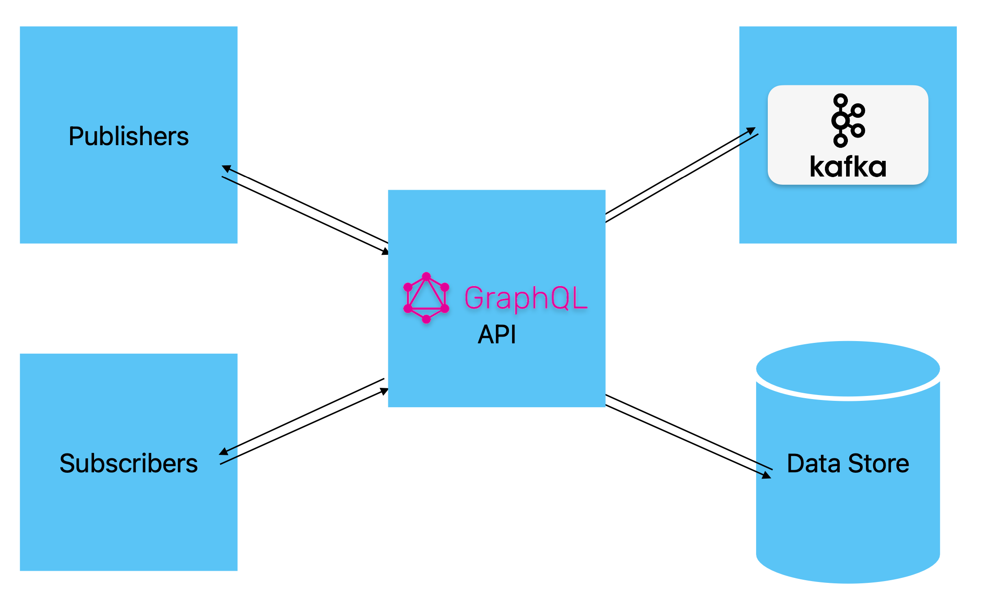

# News Alert System

## Introduction

In this example, a news alert system is designed. It has the following features.

- There are pre-defined news agencies.
- Publishers can register with a news agency.
- Subscribers can register to the news alert system.
- Subscribers can subscribe to a particular news agency.
- When a publisher from a news agency publishes news, all the subscribers of that news agency receive the news in real-time.


## Design

The news alert system uses a GraphQL API. Internally, GraphQL uses Apache Kafka for handling real-time events. The system is implemented using Ballerina.

Following is a diagram to show the high-level architecture of the system:




### GraphQL API

The GraphQL API connects the Data Store, Kafka broker, Publishers, and Subscribers. Following is the schema of the GraphQL service. This will be auto-generated by the Ballerina GraphQL engine, once the Ballerina GraphQL service is written.

```graphql
type Query {
    users: [User!]!
    publishers: [Publisher!]!
}

type Mutation {
    publish(update: NewsUpdate!): News!
    registerUser(newUser: NewUser!): User!
    registerPublisher(newPublisher: NewPublisher!): Publisher!
}

type Subscription {
    news(userId: String!, agency: Agency!): News!
}

type NewUser {
    name: String!
    age: Int!
}

type NewPublisher {
    name: String!
    agency: Agency!
}

type User {
    id: String!
    name: String!
    age: Int!
}

type Publisher {
    id: String!
    name: String!
    agency: Agency!
}

type NewsUpdate {
    headline: String!
    brief: String!
    content: String!
    publisherId: String!
}

type News {
    id: String!
    headline: String!
    brief: String!
    content: String!
    publisher: Publisher!
}

enum Agency {
    CBC
    BNN
    FIRST_NEWS
}
```

>**Note:** For the sake of simplicity of this example, the news agencies are pre-defined.

#### `Query` Type

Query type has two fields.

- The `users` Field
  Can be used to retrieve the information about the existing users of the news alert system. This will return an array of `User` type.
- The `publishers` Field
  Can be used to retrieve the information a bout the existing news publishers registered to the news alert system. This will return an array of `Publisher` type.

#### `Mutation` Type

Mutation type has three fields.

- The `registerUser` Field
  Can be used to register new users for the news alert system. It takes a single argument `newUser` that is of type `NewUser`. It contains the `name` and the `age` of the user. This will return a value of `User` type, which includes the user information along with the user ID created for for the user after a successful registration. This ID then can be used to subscribe to different news agencies.
- The `registerPublisher` Field
  Can be used to register new publishers for the news alert system. It takes a single argument, `newPublisher` that is of type `NewPublisher`. It contains the `name`, `area`, and the `agency` of the publisher. This will return a value of `Publisher` type, which will include the publisher information along with the publisher ID created for the publisher after a successful registration. This ID can then be used to publish news updates under the registered agency.
- The `publish` Field
  Can be used to publish a news update. It takes a single argument `update` that is of type `NewsUpdate`. It contains the `headline`, `brief`, `content`, and `publisherId`. This will return `NewsRecord` value, which contains the information about the published news update along with the ID generated for the published news item.

#### `Subscription` Type

Subscription type has a single field.

- The `news` Field
  Can be used to subscribe to a particular news agency. It takes two arguments, `userId`, which is generated when the user is created, and the `agency`, to which the user needs to subscribe. When a user subscribed to a news agency, the GraphQL API will continuously sends the news updates from that agency whenever a new update is published.

### Data Store

The data store is used to store information about the publishers and the subscribers. There are two tables in the data store.

- User Table
  The user table is used to store information about the subscribers of the news alert system. When a user is registered through the GraphQL API, a new entry is added to the user table, storing the `userId`, `name`, and `age`.

- Publisher Table
  The publisher table is used to store information about the publishers of the news alert system. When a publisher is registered through the news alert API, a new entry is added to the publisher table, storing the `publisherId`, `name`, `area`, and the `agency`.

>**Note:** For the sake of simplicity of the example, in-memory Ballerina tables are used as the data stores.

### Kafka

Apache Kafka is used for handling real-time events in the news alert system.

- Each news agency has a separate Kafka topic.
- When a publisher from a particular news agency publishes a piece of news through the GraphQL API, that news is published to the corresponding Kafka topic.
- When a subscriber subscribes to a particular news agency using GraphQL subscription, a new Kafka consumer is created for the topic and all the events published to that topic is dispatched to the user through GraphQL API.

## Prerequisites

- Download and install [Ballerina Distribution](https://ballerina.io/downloads)
- Download [Apache Kafka](https://kafka.apache.org/downloads)
- VS Code with [Ballerina plugin](https://marketplace.visualstudio.com/items?itemName=WSO2.ballerina) (Recommended) or any other IDE

## Implementation

### Creating a Project

To create a new Ballerina project, execute the following command in a terminal. (Make sure that the Ballerina is installed correctly). The Ballerina `service` template can be used to create the Ballerina project.

```shell
bal new news_alerts --template service
```

This will create a new directory named `news_alerts` and in will contain the following files.

```shell
news_alert
├── Ballerina.toml
├── service.bal
└── tests
    └── service_test.bal
```

>**Note:** To reduce the complexity, this example does not intend to describe the testing of the project. The GitHub repository contains the tests as well.

### Defining Types

First, the Ballerina types that are used in the GraphQL service are defined. These types can be found in the `types.bal` file.

#### Input Types

In Ballerina GraphQL, `record` types are used to represent GraphQL input objects. There are three input object types are defined in the GraphQL schema: `NewUser`, `NewPublisher`, and `NewsUpdate`. Following record type definitions are used to represent these input object types.

```ballerina
type NewUser record {|
    string name;
    int age;
|};

type NewPublisher record {|
    string name;
    string area;
    Agency agency;
|};

type NewsUpdate record {|
    string headline;
    string brief;
    string content;
    string publisherId;
|};
```

#### Enums

The pre-defined news agencies are defined using an enum, `Agency`. Ballerina enums can be used to define GraphQL enums. Following is the enum definition.

```ballerina
enum Agency {
    FIRST_NEWS,
    BNN,
    CBC
}
```

#### Output Objects

In Ballerina, a GraphQL output object can be defined using either a Ballerina `service` type, or a Ballerina `record` type. If an object does not have fields with input arguments and does not need calculations/processing for resolve the field value, a `record` type can be used. Otherwise, a `service` type can be used.

Since the `User` and the `Publisher` object types do not have any field with inputs and they do not need any calculation/processing to resolve the field value, `record` types can be used to define these types. Note that the Ballerina type inclusion is used to copy the similar fields from the previously defined `record` types. Only the additional `id` field is added.

```ballerina
type User record {|
    readonly string id;
    *NewUser;
|};

type Publisher readonly & record {|
    readonly string id;
    *NewPublisher;
|};
```

But the `News` type has some processing to do since it has a `publisher` field that needs to be loaded from a separate table. Therefore, a `service` type is used to represent the `News` type. A `NewsRecord` type is defined to initialize the `News` type.
The `resource` methods of the `service` type are used to represent GraphQL object fields.

```ballerina
type NewsRecord readonly & record {|
    readonly string id;
    *NewsUpdate;
|};

isolated service class News {
    private final readonly & NewsRecord newsRecord;

    isolated function init(NewsRecord newsRecord) {
        self.newsRecord = newsRecord;
    }

    isolated resource function get id() returns string => self.newsRecord.id;

    isolated resource function get headline() returns string => self.newsRecord.headline;

    isolated resource function get brief() returns string => self.newsRecord.brief;

    isolated resource function get content() returns string => self.newsRecord.content;

    isolated resource function get publisher() returns Publisher {
        lock {
            return publisherTable.get(self.newsRecord.publisherId);
        }
    }
}
```

Now all the required types are defined.

### Defining Data Sources

To keep this example simple, Ballerina in-memory tables are used. Ballerina has a built-in `table` type that suites this scenario. Note that these can be easily converted to a relational database.

Following are the definitions of the two tables that are used in this example to store the users and the publishers. These tables are defined in the `datasource.bal` file.

```ballerina
isolated table<User> key(id) userTable = table [];

isolated table<Publisher> key(id) publisherTable = table [];
```

### Implementing Kafka Connectivity

Ballerina has a `ballerinax/kafka` package, which is a part of the Ballerina extended library, that is used to communicate with a Kafka broker. It is used in this example.

> **Note:** To use `ballerinax/kafka` package, it should be pulled from the Ballerina central. To pull the package, execute the following command in a terminal.
> ```shell
> bal pull ballerinax/kafka
> ```
> Alternatively, the Ballerina VS Code plugin can be used to pull the package via code actions.

All the Kafka-related code in this example is found in `kafka_utils.bal` file.

There are two main functionalities that are related to Kafka in this example.

- When a publisher publishes a news update, that update should be published to a Kafka topic.
- When a user subscribes to an agency, a new Kafka consumer should be created for consuming all the updates from that topic as a Ballerina `stream` type which used to send/receive streams of data in Ballerina. In Ballerina GraphQL, a subscription operation must return a `stream` type in order to send data continuously to the subscribers.

#### Producing News

To produce a news record to a Kafka topic, a Kafka producer is needed. In this example, a single Kafka producer is used to produce the news. Following code shows how to define a Kafka consumer and how to produce a news update to the Kafka topic. In this example, the default Kafka broker is used, therefore the `kafka:DEFAULT_URL` is used as the Kafka broker URL.

The `produceNews` function takes a `NewsUpdate` record (that was defined earlier) and generates an ID for the update, then publishes it to the Kafka topic related to the agency.

The `getAgency` function is used to retrieve the agency of the publisher. It will return an `error` if the publisher is not found.

```ballerina
import ballerina/uuid;

isolated function produceNews(NewsUpdate newsUpdate) returns NewsRecord|error {
    kafka:Producer producer = check new (kafka:DEFAULT_URL);
    string id = uuid:createType1AsString();
    Agency agency = check getAgency(newsUpdate.publisherId);
    NewsRecord news = {id: id, ...newsUpdate};
    check producer->send({topic: agency, key: id, value: news});
    return news;
}

isolated function getAgency(string publisherId) returns Agency|error {
    lock {
        if publisherTable.hasKey(publisherId) {
            return publisherTable.get(publisherId).agency;
        }
    }
    return error("Publisher not found");
}
```

>**Note:** The `ballerina/uuid` package is used to generate unique IDs. Since it is a Ballerina standard library package, no additional work is needed for using it.

#### Consuming News

News consuming should be done in the following manner.

- If a user requested to subscribe to a particular news agency, a new Kafka consumer with a new user group should be created, in order to make sure all the users receive all the news published to a particular topic.
- Since publishing news is a continuos process, and the GraphQL subscription needs to return a Ballerina `stream`, all the consumed news should be added to a `stream`.

To do this, a Ballerina `StreamGenerator` class is used. Each time a `StreamGenerator` is created, a new Kafka consumer is created for retrieve messages from the Kafka topic. A `StreamGenerator` must define a `next` method that will return a record in which the retrieved news is stored in the `value` field. It uses a `configurable` variable `POLL_INTERVAL` for polling the Kafka records from the server, and after polling, returns the news update or logs an error/warning if polling fails.

Following code snippet defines the `StreamGenerator` object.

```ballerina
configurable decimal POLL_INTERVAL = 100.0;

isolated class NewsStream {
    private final string consumerGroup;
    private final Agency agency;
    private final kafka:Consumer consumer;

    isolated function init(string consumerGroup, Agency agency) returns error? {
        self.consumerGroup = consumerGroup;
        self.agency = agency;
        kafka:ConsumerConfiguration consumerConfiguration = {
            groupId: consumerGroup,
            offsetReset: "earliest",
            topics: agency,
            maxPollRecords: 1 // Limit the number of records to be polled at a time
        };
        self.consumer = check new (kafka:DEFAULT_URL, consumerConfiguration);
    }

    public isolated function next() returns record {|News value;|}? {
        NewsRecord[]|error newsRecords = self.consumer->pollPayload(POLL_INTERVAL);
        if newsRecords is error {
            // Log the error with the consumer group id and return nil
            log:printError("Failed to retrieve data from the Kafka server", newsRecords, id = self.consumerGroup);
            return;
        }
        if newsRecords.length() < 1 {
            // Log the warning with the consumer group id and return nil. This will end the subscription as returning
            // nil will be interpreted as the end of the stream.
            log:printWarn(string `No news available in "${self.agency}"`, id = self.consumerGroup);
            return;
        }
        return {value: new (newsRecords[0])};
    }
}
```

### Implementing the GraphQL API

Now the GraphQL API can be implemented since all the other types/methods are defined. To define a GraphQL service, the `ballerina/graphql` package is used. It is a part of the Ballerina standard library. Therefore, no additional work is needed.

Following code snippet shows how to define a GraphQL service in Ballerina. Remove the code in the `service.bal` and use this code to implement the GraphQL service.

Ballerina GraphQL comes with a built-in GraphiQL client for testing purposes, which can be enabled through `graphql:ServiceConfig`. It is enabled via a `configurable` variable `ENABLE_GRAPHIQL`. Value of this variable is provided in the `Config.toml` file in the project.

```ballerina
import ballerina/graphql;

configurable boolean ENABLE_GRAPHIQL = ?;

@graphql:ServiceConfig {
    graphiql: {
        enabled: ENABLE_GRAPHIQL
    }
}
service /news_alert on new graphql:Listener(9090) {
    // Implement the resource and remote methods here
}
```

#### `Query` Fields

As per the GraphQL schema, there are two fields in the `Query` type. In Ballerina, `resource` methods with `get` accessor are used to represent the fields of the `Query` type. Following are the definitions of the `resource` methods that represent the fields of the `Query` type. Add these methods inside the GraphQL service defined previously.

```ballerina
resource function get users() returns readonly & User[] {
    lock {
        return from User user in userTable
            select user.cloneReadOnly();
    }
}

resource function get publishers() returns readonly & Publisher[] {
    lock {
        return from Publisher publisher in publisherTable
            select publisher.cloneReadOnly();
    }
}
```

#### `Mutation` Fields

As per the GraphQL schema, there are three fields in the `Mutation` type. In Ballerina, `remote` methods are used to represent the fields of the `Mutation` type. Following are the definitions of the remote methods that represents the fields of the `Mutation` method. Add these methods inside the service defined previously.

```ballerina
remote function publish(NewsUpdate & readonly update) returns NewsRecord|error {
    lock {
        if publisherTable.hasKey(update.publisherId) {
            return produceNews(update).cloneReadOnly();
        }
    }
    return error("Invalid publisher");
}

remote function registerUser(NewUser newUser) returns User {
    string id = uuid:createType1AsString();
    lock {
        User user = {id: id, ...newUser.cloneReadOnly()};
        userTable.put(user);
        return user.cloneReadOnly();
    }
}

remote function registerPublisher(NewPublisher newPublisher) returns Publisher {
    string id = uuid:createType1AsString();
    lock {
        Publisher publisher = {id: id, ...newPublisher.cloneReadOnly()};
        publisherTable.put(publisher);
        return publisher.cloneReadOnly();
    }
}
```

>**Note:** Ballerina `lock`s are used to access the tables to make this concurrency-safe, enabling the methods to run parallelly.

#### `Subscription` Fields

As per the GraphQL schema, there is a single field in the `Subscription` type. In Ballerina, `resource` methods with `subscribe` accessor are used to represent the fields of the `Subscription` type. Following is the definition of the `resource` methods that represent the fields of the `Query` type. Add this method inside the GraphQL service defined previously.

The previously created `StreamGenerator` type is used to return a `stream` from this method.

```ballerina
resource function subscribe news(string userId, Agency agency) returns stream<News>|error {
    stream<News> newsStream;
    lock {
        if userTable.hasKey(userId) {
            NewsStream newsStreamGenerator = check new (userId, agency);
            newsStream = new (newsStreamGenerator);
        } else {
            return error("User not registered");
        }
    }
    return newsStream;
}
```

## Running the Service

- First, [run the Kafka broker](https://kafka.apache.org/quickstart) in a terminal.

- Then in another terminal, run the Ballerina project. To run the project, execute the following command inside the project directory.
  ```shell
  bal run
  ```

- After running the project, a GraphiQL client will be running on `localhost:9090/graphiql`. Use a web browser to access it.
- Using the browser, register a new user using the following document.
  ```grpahql
  mutation {
    registerUser(newUser: {name: "John Doe", age: 30}) {
        id
    }
  }
  ```
  This will return a response similar to the following.
  ```json
  {
    "data": {
      "registerUser": {
        "id": "01eda2b9-1d25-1816-97f8-c39f3cf1e39e"
      }
    }
  }
  ```
  Keep the user ID received from the GraphQL service for future usage.
- Then register a new publisher using the following document.
  ```graphql
  mutation {
    registerPublisher(newPublisher: {name: "Jane Doe", area: "Colombo", agency: CBC}) {
      id
    }
  }
  ```
  This will return a response similar to the following.
  ```json
  {
    "data": {
      "registerPublisher": {
        "id": "01eda2b9-6970-1c10-8f79-534f8bf7ae46"
      }
    }
  }
  ```
  Keep the publisher ID received from the GraphQL service for the future usage.
- Now subscribe to a news agency using the following document.
  ```graphql
  subscription {
    news(userId: "01eda2b9-1d25-1816-97f8-c39f3cf1e39e", agency: CBC) {
      headline
      publisher {
        name
      }
    }
  }
  ```
- In a separate browser tab, use the following document to publish a news.
  ```graphql
  mutation {
    publish(update: {headline: "Hello", brief: "Hi", content: "Hello world!", publisherId: "01eda2b9-6970-1c10-8f79-534f8bf7ae46"}) {
      id
    }
  }
  ```
- Now, check the browser tab that used to subscribe to the news agency. It will show the published news message similar to this.
  ```json
  {
    "data": {
      "news": {
        "headline": "Hello",
        "publisher": {
          "name": "Jane Doe"
        }
      }
    }
  }
  ```
